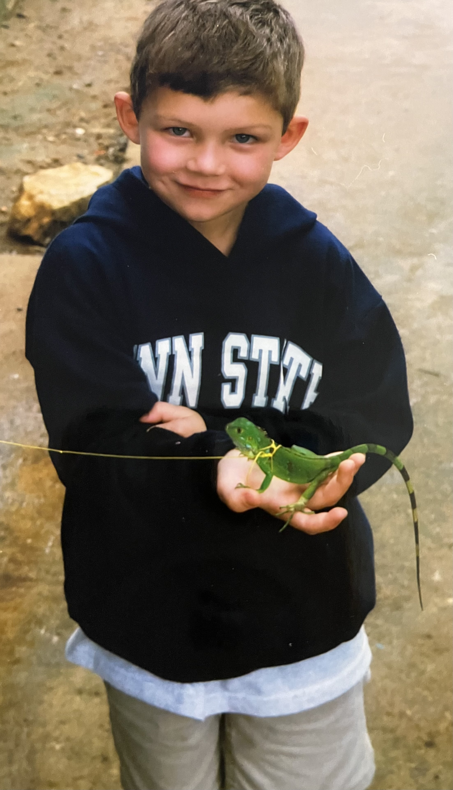
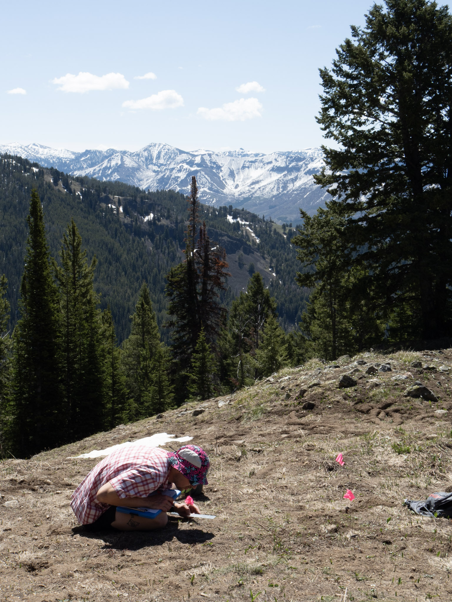
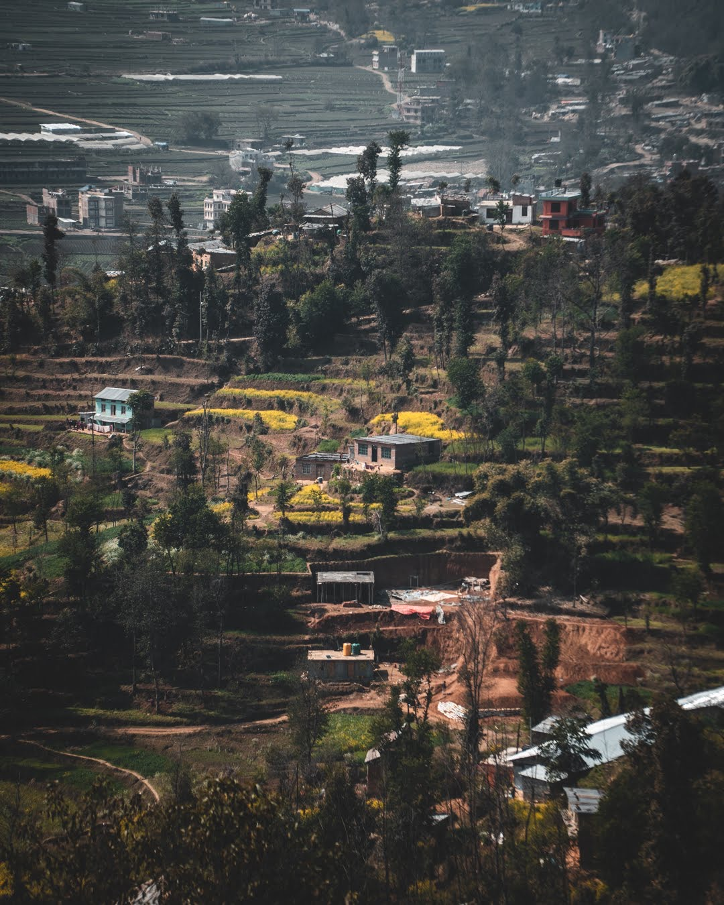
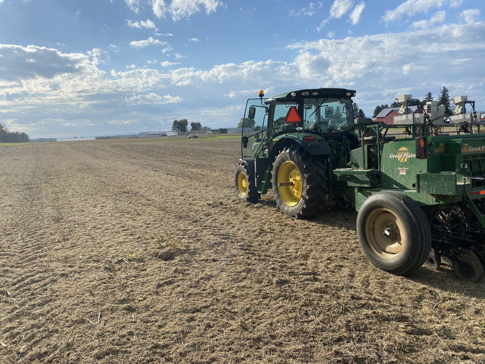
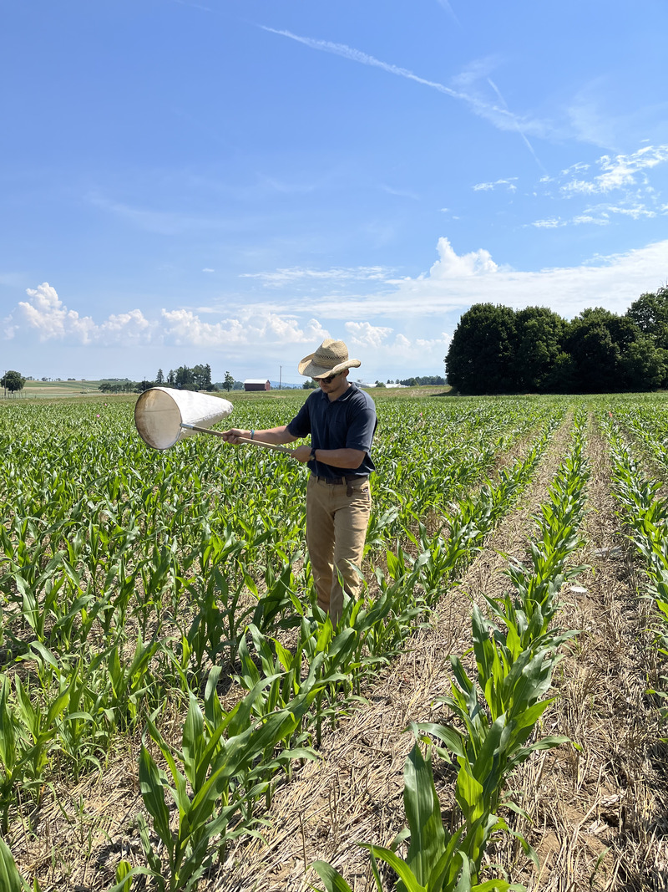
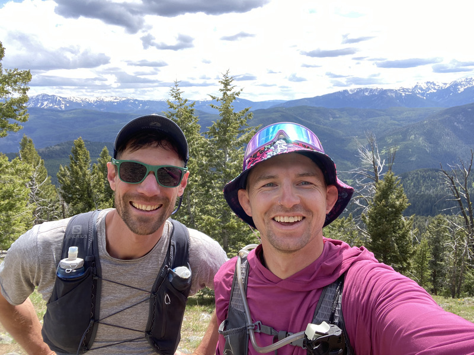
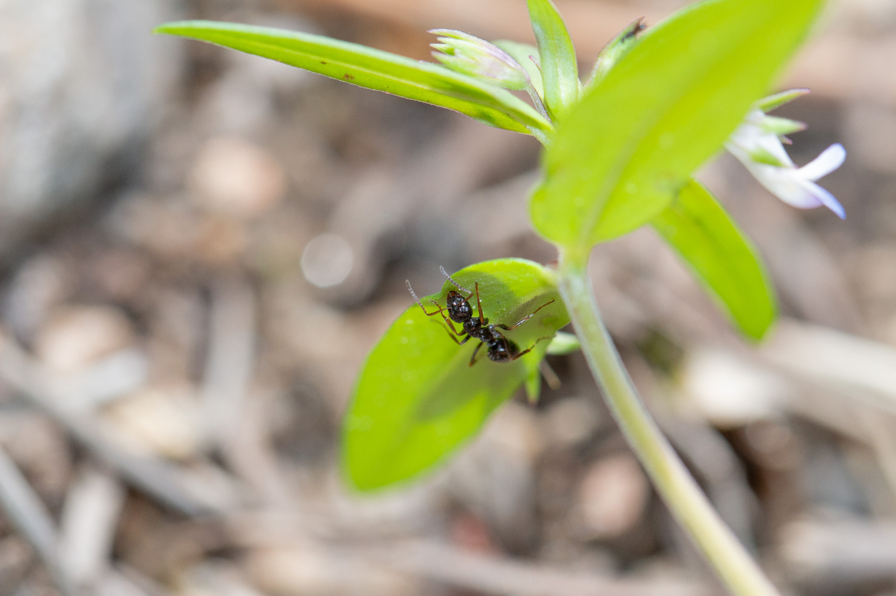
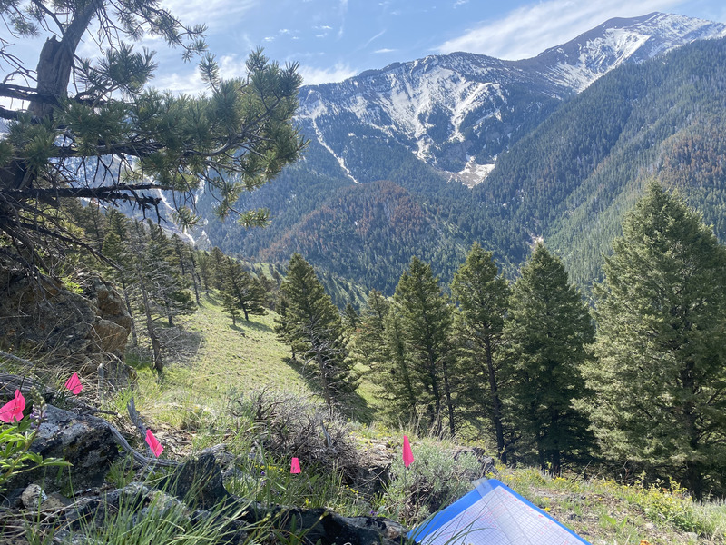

### Lettuce start with the future, eh?

  Upon the completion of my PhD, I would like to teach entomology and applied statistics and programming through an ecological lens. I see myself working at a small-mid sized R1 university, but am open to job opportunities that allow me to build curriculum. For more information about my teaching history and plans for the future, please see [this](teaching.qmd) page. **Please** read below for more about how I ended up in a PhD program. 

### About me

I am considered an **Entomologist** by most, a **Quantitative Ecologist** by some, and in a former life, I was an **Agroecologist**. I am from a small town in Northeastern Pennsylvania, where I spent much of my time wrestling, playing baseball, skateboarding, hunting, and fishing. Indeed, I was a *bug kid*, but it was not until my junior year of undergrad that I learned studying arthropods could be a career. From that moment on, I dedicated much of time to learning all I could about insects and other arthropods. I added the entomology minor to my course load which added a year to my degree, took graduate-level courses, sought internships with a focus on entomology, and started considering graduate programs. I finished my undergraduate degree with a major in Plant Sciences, Agroecology option, and minors in Entomology, International Agriculture, and Soil Science. 

::: {layout-ncol=3}

:::

**Figure 1**. From left to right. Me as a child subjected to wear Penn State gear by my parents who are both alumni. Then, a pre-match photo of me wrestling in highschool. And lastly, collecting data on *Collinsia parviflora* during my PhD.

### My journey back to Penn State 

  Upon the completion of my undergraduate degree in December 2019, I joined **Peace Corps Nepal**. Regrettably, due to the COVID-19 pandemic, in March of 2020, the Peace Corps underwent a global evacuation from all countries. Upon returning to the US, I got a job in agri-chemical research at [Lehigh Agricultural and Biological Services](https://www.labservices.com/). I had interned here as an undergraduate, so, the transition to a full-time employee was all but seamless. In 2021, I went back to Penn State to work for [Dr. John Wallace](https://plantscience.psu.edu/directory/jmw309) in the **Weed Science** department. While I loved working for Wallace, my passion was (and still is) **entomology**, and in 2022 I finally joined my first **Entomology lab**. In August of 2022, I started a Master's degree with [Dr. John Tooker](https://ento.psu.edu/research/labs/john-tooker).
  
  At the start of my master's degree, I did not have a good sense of where I wanted to end up. I knew an MS in entomology would help me get a cool job, but I had not yet considered a PhD, or what my dream job was. During my second semester in our required professional development course, I was introduced to a PhD requirement: **The Comprehensive Exam.** While a daunting idea, there was something exciting about the idea of being in a room in front of handful of excellent scientists being asked questions, and challenged, about my own research project and interests. It is challenging to try and articulate why this resonated so much, but it planted the seed in my head of pursuing a PhD.
  
  The second, and final reason, why I chose a PhD was inspired by *teaching*. Being an instructor and sharing knowledge is a great passion of mine. Whether it be as a wrestling coach, a rescue-rope instructor with the National Ski Patrol, or an introduction to Entomology instructor, I love teaching. It brings me great joy sharing knowledge, encouraging students, and facilitating a space for all learning styles. During the same course previously mentioned, the head of the biology teaching department came and spoke to us about seeking a job as an instructor in academia. During this class, she told us that, at least at PSU, the likelihood of someone being hired for a tenure-track teaching / teaching and research position *without* a PhD is next to **0**. As someone who was starting to think about teaching at the college level, this was all I needed to hear. In that moment, I committed to myself that I would pursue a PhD. The next questions were: **Where? With who? And, do I have to stay in agricultural research?**
  
::: {layout-ncol=3}

:::

**Figure 2**. From left to right. A photo taken of the community (outskirts of Panauti) I lived in from a hilltop on the edge of town. Then, my rig for drilling cover crops in the Fall. And lastly, sweeping corn for arthropods during my master's degree. 

### Cold-calling everyone, everywhere, all at once.

If you have ever tried to cold-call faculty to get their attention, you know how awful it can be. If I had to reflect, I would estimate for every 10 emails I sent, I received **3 responses**. Furthermore, I was interested in leaving ag and seeking a position in natural-system entomology and ecology, so I did not know *who* to email. So, as one does, I spent much of the summer of 2023, when not doing fieldwork, drafting and sending emails to faculty at Universities in the Northeast. Why the Northeast, you ask? Well, simply, I did not see myself moving West, so I did not consider these Universities. 

It was during this time that I began to think more seriously about the *type* of research I wanted to do. I had interests in plants, insects, climate change, community dynamics, and lastly, **mountains**. With this realization, my gaze broadened, and I started looking to the West Coast and greater Rocky Mountain region. After a number of cold-call emails, and a surprising response rate, I still felt lost in my journey of finding the right PhD program for me. 

Alas, I found myself spending more time sending emails and having meetings on zoom than I was doing my own research, but to no avail, I was lost. But then, a few months prior to the 2023 National Entomology meeting, I had a break through. One of my mentors, [Dr. Sara Hermann](https://whatsconsumingyou.wordpress.com/)-knowing my interests in natural systems and desire to become a quantitative ecologist-name dropped **Dr. Will Wetzel.** Little did I know, but I was about to send what be the *final* cold-call email of my master's degree. 
  
  
At present, I am a PhD student of [Dr. Will Wetzel](https://wetzellab.com/) in the Land Resources and Environmental Sciences (LRES) program in the College of Agriculture at **Montana State University**. I am broadly interested in how global environmental change drives plant-insect interactions. My work focuses on plant **tolerance** to herbivory and I seek to understand how plants can, or cannot, handle an increase in both abiotic and biotic stress. For example, how does an increase in abiotic stress drive insect-herbivore populations? What physiological traits do plants rely to *handle* an increase in the **dual threat** of abiotic and biotic pressure? Can we predict the role of arthropod predators in plant fitness?

::: {layout-ncol=3}

:::

**Figure 3**. From left to right. Will and myself at one of my field sites. Then, a close-up of *Collinsia parviflora*. And lastly, a photo of one of my field sites in the Bridger range. 

##
